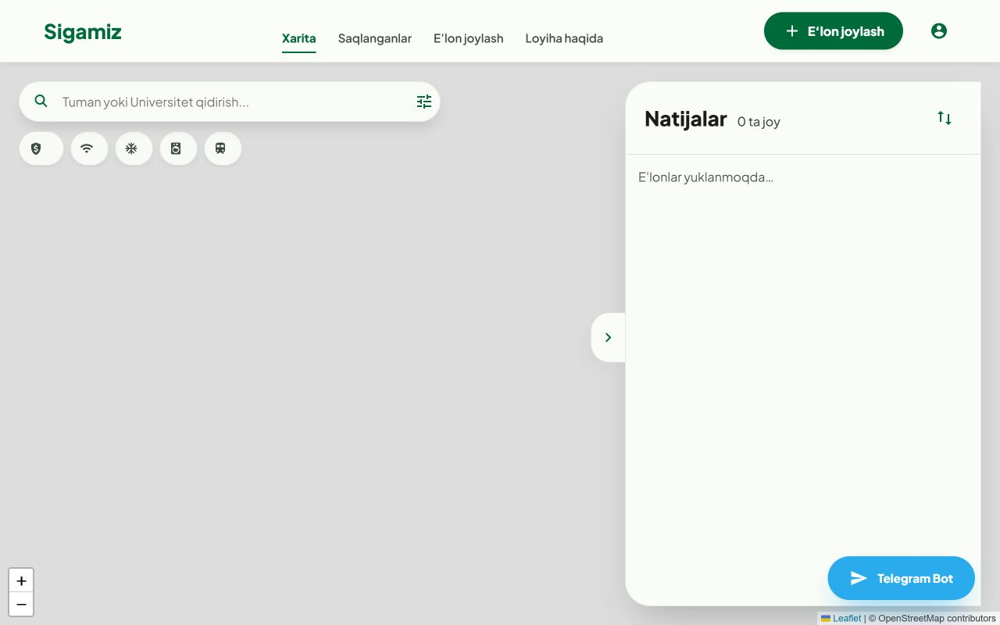
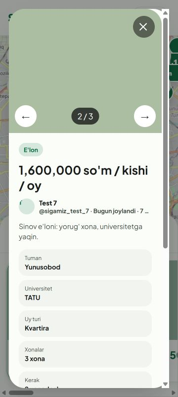
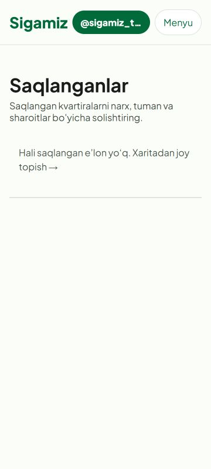

# Исправления после аудита — 2 октября 2026

## Текущее состояние

Исправления API, общего backend и сайта применены в рабочем дереве. Обновление `bot/main.py` **не применено**: автоматическая проверка отклонила комплексную правку из-за риска нарушения авторизации, публикации и запуска сервисов. Пользователю отправлен запрос разрешения; ответа пока нет. Исходный бот сохранён. Конкретная подготовленная версия: [bot_main.py](../proposals/bot_main.py); генератор: [prepare_bot_proposal.py](../prepare_bot_proposal.py).

Не выпускать эту промежуточную пару API/бота. Новый API требует кода и явного подтверждения; старый бот их не поддерживает. `scripts/check_bot_contract.py` намеренно блокирует CI/deploy до применения и проверки бота. Продакшен, его база и реальные Telegram-сообщения не затрагивались. Коммита, push и деплоя не было.

## Все пункты исходного аудита

| Пункт | Что исправлено | Статус |
|---|---|---|
| B1: обход бана | Общий сервис проверяет бан внутри транзакции; сайт возвращает отказ | Применено |
| B2: точные координаты | Одна публичная сетка для обоих каналов; миграция существующих записей; описание приватности обновлено | Применено |
| B3: дубликат самого себя | Дедупликация собственных фото, исключение текущего ID, отказ от хеша одноцветных изображений | Применено |
| B4: сроки и статусы | Публичные запросы проверяют expiry; удалённые/скрытые сохраняют статус; общий lifecycle; продление на сайте | API/общий модуль применены; `/my` и управление бота подготовлены |
| B5: Telegram ID | BIGINT в схеме и версия миграции для PostgreSQL | Применено; подключение миграций в запуск бота подготовлено |
| B6: гонка одного объявления | Уникальный частичный индекс, блокировка владельца/SQLite-транзакция, проверка продления | Применено |
| B7: потеря условий поиска | Единая нормализация/SQL и сохранение обоих gender; очищение невыбранных полей | API/общие модули применены; вызовы из бота подготовлены |
| B8: уведомления до commit | Транзакционная очередь, повторные попытки, дедупликация события/получателя, точная ссылка | API применён; старую отправку из бота заменяет подготовленная версия |
| B9: недоступные фото | Переносимые ключи, общий volume или S3, проверка topology, мигратор старых файлов | Применено; бот использует общий storage в подготовленной версии; инфраструктуру надо настроить при выпуске |
| B10: потеря черновика бота | DB-черновики, блокировки на весь read/modify/write между потоками/процессами; импорт JSON без перезаписи | Общий модуль применён и проверен; подключение к обработчикам бота подготовлено |
| B11: входы/ресурсы | Проверка типов/конечности чисел/справочников; 5 фото × 5 MB; предел декодированных пикселей/JSON; EXIF; rollback и очистка файлов; finally для соединений API | Применено; бот получает общие ограничения через сервис |
| B12: бессрочная сессия | Непрозрачный токен, hash в БД, серверный expiry, отзыв при logout, HTTPS Secure; кнопка выхода | Применено |
| B13: отсутствие контакта/ложный успех | Телефон обязателен без username; сайт показывает реальную причину отказа/статус проверки | Общий сервис/сайт применены; сообщения и шаг контакта бота подготовлены |
| B14: запуск/тесты | Lifespan API, отдельный владелец миграций, offline tests, CI, проверка перед рестартом и HTTP после запуска | API/проверки применены; безопасный entry point бота подготовлен |
| B15: чужая bot-login ссылка | Код, явное подтверждение, browser binding, 10 минут, 5 попыток, атомарное одноразовое потребление; legacy approve отклоняется | API применён и закрывает старый обход; новый сценарий бота подготовлен |
| U1: сжатые карточки | Карточки и фото не сжимаются при большом числе результатов | Применено, браузер |
| U2: `tel:+` | Общая очистка номера; проверена полная телефонная ссылка | Применено, браузер |
| U3: скрытый required | Координаты hidden; видимая ошибка и фокус адреса | Применено, браузер |
| U4: недоступный диалог | role/label/modal, inert, Tab trap, Escape, возврат фокуса; настоящие ссылки карточек | Применено, браузер |
| U5: переполнение | Ограничены flex/grid-элементы и длинное имя; детали/публикация/избранное укладываются в 360 px | Применено, браузер |
| U6: размер маркера | divIcon и видимый ценник имеют одинаковую геометрию 80 × 36 | Применено, браузер |
| U7: фиктивные объявления | Demo fallback удалён; ошибка с retry вместо сгенерированных карточек | Применено, браузер |
| U8: пустое избранное | Явное empty state с переходом на карту; после входа нет повторного login prompt | Применено, браузер |

Дополнительный UX: цена за человека в месяц, newest order, независимый total, точные deep links, вся галерея, поля пола/нужного числа людей, полная мобильная навигация, понятные статусы, продление/удаление владельцем на сайте, защита от повторной отправки и устаревшего fetch, сохранение личного черновика и фото, предупреждение при уходе, если сохранить не удалось. Найденный адрес сохраняется в черновике сразу. Необоснованные утверждения об успешном подборе/проверенности удалены. Исправлены повреждённые символы текста. Устаревшие HTML архивированы вне публичного каталога.

## Переиспользование

Общие владельцы правил: `catalogs`, `search`, `listing_service`, `lifecycle`, `security`, `notifications`, `storage`, `drafts`, `migrations`. Мёртвые копии удалены из API, из подготовленной версии бота и из страниц сайта. Frontend использует `shared.js`, `auth.js`, `draft.js`, `shared.css`; каталоги получает из API. Полное устранение backend-дублирования требует применения подготовленного бота.

README и FEATURES актуализированы, включая промежуточный статус, новые cookies, хранение фото и команды переноса старых данных. Продакшен-миграции не запускались.

## Результаты проверки

- 25 тестов `tests/`: **PASS**. Временная SQLite, синтетические пользователи, пустой BOT_TOKEN. Гонки публикации, баны, срок/продление, photo duplicates/cleanup, единый поиск, bound login, старый обход, отзыв сессии, параллельные черновики, миграции и доставка с retry.
- 4 теста `audit/test_bot_proposal.py`: **PASS**. Импорт без старта БД/потоков; код входа с восстановлением текущего черновика; сохранение поиска при найденных результатах; корректное сообщение о review; реальная публикация через общий сервис. Telegram API замокан.
- `node scripts/check_frontend.js`: **PASS**, 8 скриптов. Проверяется синтаксис и повреждение кодировки.
- AST всех backend-файлов и кандидата бота: **PASS**. `git diff --check`: **PASS**.
- `python scripts/check_bot_contract.py`: **BLOCKED EXPECTED**, действующий `bot/main.py` ещё legacy. Это ограничение выпуска, а не подтверждение завершённого обновления.

Браузер: Chrome, 1280 × 800 и 360 × 800, только временная база/фото и отдельный локальный сервер. На desktop высота карточки 443 px, фото 232 px, ширина pin 80 px; документ 1280/1280 без горизонтального переполнения. На mobile проверены диалог/галерея/номер/Escape/focus restore, меню, ошибка API, пустое избранное, продление, видимая ошибка адреса, восстановление адреса/координат после reload и logout. Synthetic geocoder использован вместо реального адресного запроса.

### Снимки после исправления

## Пределы

Живой PostgreSQL не был доступен: проверены BIGINT/перевод SQL и миграционное поведение на SQLite, но это не заменяет прогон на PostgreSQL перед выпуском. S3 проверен mock-адаптером; реальные bucket/volume/credentials надо проверить при настройке инфраструктуры. Нельзя восстановить отсутствующие старые фото без оригинальных файлов. Доставка Telegram имеет семантику at least once при неоднозначном сетевом ответе. Миграции и подготовленный бот следует выпускать согласованно после разрешения и итоговой проверки.
